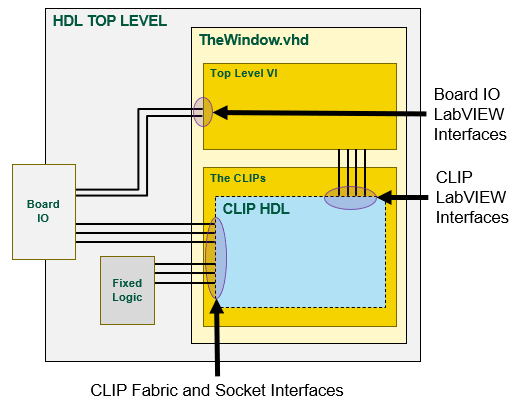
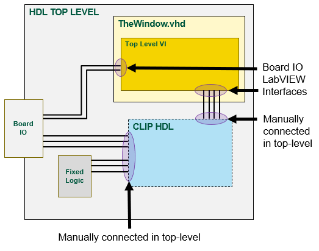
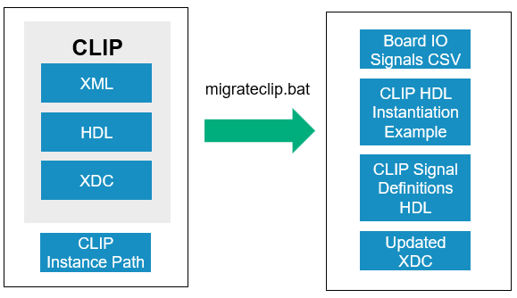

This is a prototype set of tools for developing HDL on LabVIEW FPGA targets.

# Command Line Tools

## Environment Setup
From the target folder (e.g., flexrio/targets/pxie-7903), run: 
> setenv.bat

This batch file puts the LabVIEW FPGA HDL Tools and Vivado in the command prompt path.  It also updates the GitHub lvfpgahdltools submodule.

## Project Settings File
The tools use the projectsettings.ini file to specify file paths and other configurations.  It is broken up into multiple sections.

### VivadoProjectSettings
This section is used by setenv.bat, createvivadoproject.bat and launchvivado.bat

* <b>TopLevelEntity</b> - Top level entity (same as its HDL file name) that gets set in the Vivado project
* <b>VivadoProjectName</b> - The name of the Vivado project that is created (no spaces allowed)
* <b>VivadoToolsPath</b> - Path to where the Vivado tools are installed.  You may point to the tools installed by NI LabVIEW FPGA Comile Tools or your own Vivado installation folder.
* <b>VivadoProjectFilesList</b> - Text files containing relative paths of source files that will be included in the Vivado project.  Specifying a directory path within the text file will recursively include all files within it.

### LVFPGATargetSettings
This section is used by genlvfpgatargetsupport.bat

#### Inputs
* <b>LVTargetBoardIO</b> - Path to CSV file that specifies names and datatypes of custom board IO that will appear on the generated custom LV FPGA target
* <b>IncludeCLIPSocket</b> - Boolean (True/False) to specify whether to include the CLIP socket on the generated custom LV FPGA target
* <b>IncludeLVTargetBoardIO</b> - Boolean (True/False) to specify whether to include the custom LV Target Board IO on the generated custom LV FPGA target

#### Templates
* <b>WindowVhdlTemplate</b> - Path to the mako template for TheWindow.vhd.  This file is processed depending on the settings in the Inputs above.
* <b>TargetXMLTemplate</b> - Path to the mako template for the target resource XML.  This file is processed depending on the settings in the Inputs above.

#### Outputs
* <b>WindowVhdlOutput</b> - Stub for TheWindow.vhd used to make signal connections in the top-level HDL file and for early synthesis.  This file will be overridden by TheWindow.vhd that is generated by LabVIEW FPGA during the Export Top VI workflow.
* <b>WindowInstantiationExample</b> - Instantiation example to help with connecting the many ports of TheWindow.vhd.  This code is not intended to be a complete cut-and-paste into the top level HDL file.  The LVTargetBoardIO signal port assignments will be most useful.
* <b>TargetXMLOutput</b> - Target resource XML for the custom LV FPGA target
* <b>BoardIOXML</b> - Custom board IO resource XML for the custom LV FPGA target
* <b>ClockXML</b> - Clock resource XML for the custom LV FPGA target

### CLIPMigrationSettings
This section is used by migrateclip.bat

#### Inputs
* <b>CLIPXML</b> - Path to the CLIP's XML file
* <b>CLIPHDLTop</b> - Path to the CLIP's top-level HDL file
* <b>CLIPXDCIn</b> - Path(s) to the CLIP's XDC constraint files (this setting supports multiple paths)
* <b>CLIPInstancePath</b> - Instantiation path to the top-level entity of the CLIP within the design hierarchy of the FPGA's top-level entity.  If entity "MyCLIP" is place directly in the FPGA's top level entity, then this setting would simply be "MyCLIP".  If it is placed deeper in the FPGA hiearchy, then that path is specified here.  This is used to process XDC constraint files.

#### Outputs
* <b>LVTargetBoardIO</b> - The LabVIEW interface IO of the CLIP XML becomes board IO on the generated custom LV FPGA target.  This CSV file is output from the CLIP migration process and will serve as an input to the generate custom LV FPGA target process.
* <b>CLIPInstantiationExample</b> - Instantiation example to help with connecting the many ports of the CLIP.  This code is not intended to be a complete cut-and-paste into the top level HDL file and will require some adjustments when using it.  
* <b>CLIPtoWindowSignalDefinitions</b> - Signal definitions for all of the ports in the CLIP entity.  This is used to copy/paste the signal definitions for the ports that connect between the CLIP and TheWindow.vhd.  These signals will need to be defined in the top-level HDL entity.
* <b>CLIPXDCOutFolder</b> - The CLIP XML is processed to use the new CLIPInstancePath to set the correct entity hierarchy within the constraints.  The contents of these XDC files will be merged into the target's XDC files.

## Create Vivado Project
From the target folder, run:
> createvivadoproject.bat

This runs the createvivadoproject.py script to generate the Vivado project.  It includes all files from VivadoProjectFilesLits in projectsettings.ini

If this is not the first time creating the Vivado project, one of these command line options are required:
> -- overwrite - Overwrites the existing Vivado project and creates a new one  
> -- updatefiles - Only updates the files in the existing Vivado project  

## Migrate CLIP
In LabVIEW FPGA, the CLIP HDL is defined by an XML file that specifies its  ports.  The ports are grouped into three interfaces:
* LabVIEW - These ports appear in the LabVIEW project as CLIP IO
* Socket - These ports are automatically connected by LabVIEW FPGA to the ports on TheWindow.vhd that connect to the FPGA top-level fixed logic
* Fabric - These ports are automatically connected by LabVIEW FPGA to the ports on TheWindow.vhd that connect to the FPGA top-level fixed logic

When the CLIP HDL is instantiated directly in the top-level HDL file, the CLIP LabVIEW interfaces become Board IO LabVIEW interfaces.  And the Socket/Fabric interfaces to the CLIP are manually connected in the top-level HDL.

To make this migration process easier, we use the CLIP migration script to process the CLIP's files and generate code that is used to instantiate the CLIP HDL directly into the top-level FPGA design.

From the target folder, run:
> migrateclip.bat

Summary of the inputs/outputs of that script:

## Generate LV Target Support
